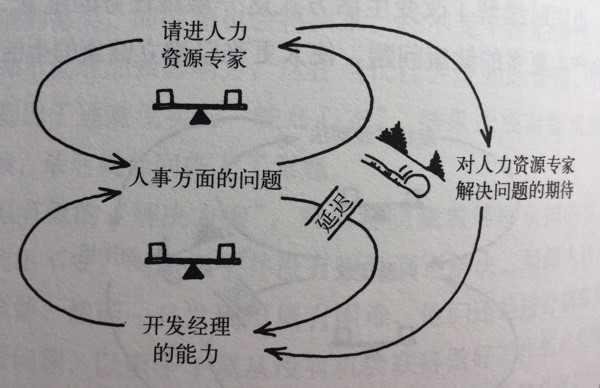

# 初识CLD

**预计总时长:** 40min  
**模块目标：** 学员对CLD有初步了解和认识，知道CLD的基本概念（what）

## 演示实例CLD  - 25min

**目标：引出概念（变量、链路、回路、系统、系统边界）**

**形式：[讲师讲解，以采用说故事的方式解说]**

-  解说示例用CLD：强制加班赶进度

## 分组读图  - 15min

**目标：能够掌握阅读基本CLD图，识别其中的问题**

**形式：分组讨论，分享，讲师点评**

- 每人单独阅读各自的CLD图 - 5min
- 组内分享&讨论，识别出问题 - 10min

## 附录

### 讲师讲解CLD

### 小组用CLD

