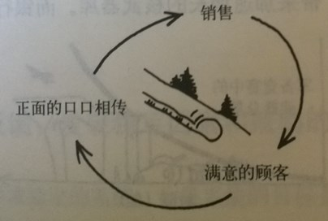
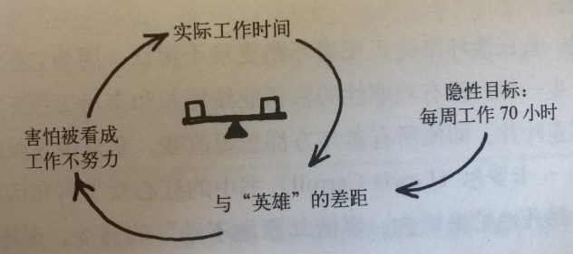
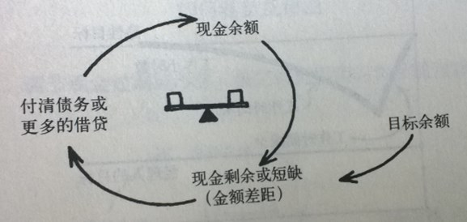

# 发现回路

**预计总时长:** 75min  
**模块目标：** 学员能理解、并绘制系统思考的基本积木块：R/B回路和延迟

## R回路的故事  - 15min

**目标：理解增强回路，看懂CLD；理解增强回路中的BOT趋势；理解反馈**

**形式：[讲师讲解，酌情加入和学员的启发式互动]**

- 讲一个R回路的故事 (案例中的增强回路部分)
- 画出故事的BOT，介绍BOT的概念
- 写出这个故事的CLD，引出反馈，提出R的概念
  - 明确给出变量：XXXX（可以讲师直接介绍变量；或者和观众互动）
  - 明确其他因素不变的情况下来做这个任务
- 描述这个回路（给它一个名称）（BOT的Y轴是关键变量）
- 其他R回路口头案例（讲师备用）：体育锻炼；反恐战争；银行挤兑；加油站排队加油；富人更富，穷人更穷；

## B回路的故事  - 15min

**目标：理解平衡回路的概念和看懂CLD；看懂平衡回路中的BOT趋势；**

**形式：[讲师讲解，酌情加入和学员的启发式互动]**

- 讲一个B回路的故事    
- 画出故事的BOT，介绍系统的目标
- 画出CLD，提出平衡的概念
- 描述这个回路（给它一个名称）（BOT的Y轴是关键变量）
- 其他口头案例（讲师备用）：人体的各种平衡机制如体温；保持平衡；愈合伤口；收支平衡

## 延迟 - 5min

**目标：让听众理解延迟的概念**

**形式：[讲师讲解，酌情加入和学员的启发式互动]**

- 引导听众，上一个水温案例是否有调节过度的情况，引出延迟
- 介绍有延迟的BOT图形（沿用上一个B回路的例子）
- 介绍延迟在CLD里的符号，出现在哪些链路上
- 引发听众思考和列举其他的延迟互动案例（见附录），使用预先准备的CLD图让听众标注延迟 
- 其他口头案例（讲师备用）：现在的投入，是为了将来的回报；员工培训；进食的感觉和吃撑之间的延迟导致吃的太多；房地产项目从开工到完工的延迟

## 练习 - 35min

**目标：让听众学会根据故事画出简单的R/B+延迟回路**

**准备4个练习故事（使用一个，三个备用）（见附录）**

- 介绍故事梗概（气温和穿衣调节、出生人口、公司内员工数、死亡人口/老龄化）- 5m
- 所有组使用同样的故事做练习，要求:
  - [输出] BOT+CLD（包括定义主题、变量、链路关系、形成反馈、发现延迟） - 20m
  - 过程中讲师给每个小组指导
  - 结束时请各小组介绍，以及总结他们学到了什么    - 10m

## 环路类型判断 - 5min

**目标：让听众学会怎样判断R/B循环类型**

- 使用刚才练习的例子来演示，讲解两种方式
  - 通过分析BOT的趋势来判断
  - 通过技术O的数量来判断（并解释为什么可以这样判断）

## 附录

### 练习环节中的4个故事

- 气温和穿衣调节：早上天气变冷了，早上出门的时候发现穿衣不够，来回加了几次衣服，最后觉得温度正好
  - 参考答案：平衡反馈；关键变量：感受到的温度，人体舒适的温度，穿着的衣服数量
- 出生人口：在一个欣欣向荣的原始社会，人口数迅速上升
  - 参考答案：增强反馈；关键变量：人口数，出生人口数
- 公司内员工数：在一个业务和市场稳定的公司内，员工数量会波动变化
  - 参考答案：带延迟的平衡反馈；关键变量：员工数，期望员工数（业务规模决定），招聘规模
- 死亡人口/老龄化：在一个老龄化社会，人口数量逐渐减少
  - 参考答案：增强反馈；关键变量：人口数量，死亡人口数量

### 延迟的现场互动案例

