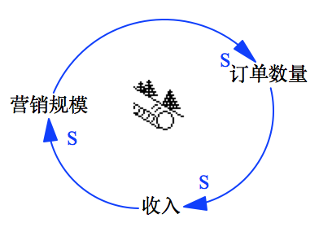

# 复杂系统回路与发现基模

<!-- toc -->

总时长：125'’
### 目标

在复杂系统中，随着对系统理解的逐步加深，往往可以识别出新的变量，由此会出现更多的系统动态相关性的回路，这种回路的组合，有别于前面提到个一的简单回路。旨在通过此环节的讲解和练习，能够帮助学员理解：

* 复杂回路的一些特点；
* 如何识别变量和绘制复杂回路的CLD；
* 好的复杂回路的CLD应该是什么样子的；
* 发现和识别基模；
* 及通过寻找杠杆点，找到解决问题的关键。

**注意**：本环节会有较多的练习及分享环节，占用时间会比较长，导师需要注意练习环节的引导，保证学员的专注度

### 引导过程

本环节通过以下几个步骤进行交付：

* 引入
* 复杂回路分组练习
* 总结针对复杂系统的复杂回路知识点
* 复杂回路综合练习
* 练习：小组间交叉挑战，根据综合练习的输出，从CLD中寻找解决问题的关键点
* 杠杆点知识点的讲解

#### 1. 引入环节 (15')

* 简单回路的例子，BOT：在单回路的场景下，我们展示相关的BOT图，提出问题，基于问题，寻找新的未被挖掘的变量，形成新的回路。

  * 问题：我们看看这个R回路，它会永远无止境的增长下去吗？

    

  * 事例：

    > 不久后又开始出现订单积压。一年以后，发货时间又开始出现延迟--先是到10周，后来又到12周，最后到了16周。于是，增加产能的问题再一次进入公司议事日程。但是，因为有了上一次被动局面的教训，高管层这次就变得很谨慎。不过建设新厂的动议后来还是得到通过。然而，批准建设新厂的签字墨迹未干，新一轮的销售下滑危机又开始了，这次的下滑非常严重，以至于市场营销副总裁被革了职。

    > 以后几年中，一连串的市场营销副总裁轮流上岗，但是每次的结果都和以前一样，营销的高增长总是昙花一现，接下来就是低增长和零增长。

    

  * 迭代的概念

* 复杂回路

#### 2. 复杂回路分组练习 (35')
* 练习 (15')：学员基于给定材料的情境，去绘制CLD图
  * 目标：通过寻找新的变量和因果关系，绘制出新的回路，组成多个回路，了解系统的复杂性会随着对问题认识的加深，会有新的认识
  * 材料：报事贴、白板纸、马克笔、案例及讲师参考
  * 主题：狼图腾
* 分享 (4 x 5')：小组分享本组绘制CLD图

#### 3. 总结回路的知识点 (30')

此环节基于上面提及的多回路分组练习的结果进行，导师在学员分享后，提出问题，让学员展开思考，并就多回路的知识点进行讲解。

##### 3.1. 复杂回路常见问题及特征 (20')
讲解点证明学员作品，过程中穿插讲解复杂回路相关知识点。
* 主次回路
* 回路的个数
* 变量的层级

##### 3.2. 系统基模 (10')
从BOT中发掘，如理想与现实的差距，提出问题，然后提出基模的概念。根据练习中提出的例子进行基模的讲解

##### 3.3. NOTE：需要继续澄清的内容
* 好的多回路的标准检查清单
* 关于多回路知识点的检查清单

#### 4. 复杂回路综合练习  (25')
##### 4.1. 各小组对同一话题进行练习 (15')
* 目标：彭励学员通过绘制新的CLD图，对复杂回路的知识点进行巩固练习，能够发现出自己CLD图中的基模
* 材料：报事贴、白板纸、马克笔、案例及讲师参考
* 主题：城市人口增长
##### 4.2. 交叉分享小组练习结果 (2 x 5')

#### 5. 练习：小组间交叉挑战，寻求解决方案 (10')

此环节要求学员从对方组的CLD题中，找出解决问题的关键。由此可以引出杠杆点的话题

* 目标：从CLD出发，找到解决问题的方案，为杠杆点的引出做好铺垫
* 材料：报事贴和马克笔
* 步骤：
  * 提出要求
  * 提出问题，帮助引导学员解题方向
  * 交叉分享各组之间找到的解决方案

#### 6. 杠杆点 (10')

让学员学会如何通过CLD找到解决问题方案    

需要把神奇公司的事情再提一次，解决问题的杠杆点提一下。

* 产能
* Open Question:
  * 解决问题还是避免问题，还是帮助理解？

