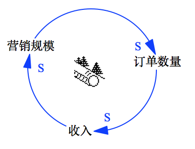

# 复杂系统回路与发现基模

<!-- toc -->

总时长：125'’
### 目标

在复杂系统中，随着对系统理解的逐步加深，往往可以识别出新的变量，由此会出现更多的系统动态相关性的回路，这种回路的组合，有别于前面提到个一的简单回路。旨在通过此环节的讲解和练习，能够帮助学员理解：

* 复杂回路的一些特点；
* 如何识别变量和绘制复杂回路的CLD；
* 好的复杂回路的CLD应该是什么样子的；
* 发现和识别基模；
* 及通过寻找杠杆点，找到解决问题的关键。

**注意**：本环节会有较多的练习及分享环节，占用时间会比较长，导师需要注意练习环节的引导，保证学员的专注度

### 引导过程

本环节通过以下几个步骤进行交付：

* 引入
* 复杂回路分组练习
* 总结针对复杂系统的复杂回路知识点
* 复杂回路综合练习
* 练习：小组间交叉挑战，根据综合练习的输出，从CLD中寻找解决问题的关键点
* 杠杆点知识点的讲解

#### 1. 引入环节 (15')

简单回路的例子，BOT：在单回路的场景下，我们展示相关的BOT图，提出问题，基于问题，寻找新的未被挖掘的变量，形成新的回路。

在上一节关于神奇公司的讨论中我们发现，通过定义“营销规模”、“订单数量”和“收入”几个变量，将它们彼此之间的关系连接起来，得到了一个R回路，即增强回路。也就是说，每个变量的增加都直接反映在下一个变量的增加上，这是一个美好的愿望，如果是这样的话，它的BOT应该如图所示，而在现实世界中，不可能出现永远都在增长情形，应该如另一个BOT所示，那么是什么变量的出现限制了R回路呢？

**问题**：它会永远无止境的增长下去吗？

让我们继续展开神奇公司这个故事。

> 不久后又开始出现订单积压。一年以后，发货时间又开始出现延迟--先是到10周，后来又到12周，最后到了16周。于是，增加产能的问题再一次进入公司议事日程。但是，因为有了上一次被动局面的教训，高管层这次就变得很谨慎。不过建设新厂的动议后来还是得到通过。然而，批准建设新厂的签字墨迹未干，新一轮的销售下滑危机又开始了，这次的下滑非常严重，以至于市场营销副总裁被革了职。

> 以后几年中，一连串的市场营销副总裁轮流上岗，但是每次的结果都和以前一样，营销的高增长总是昙花一现，接下来就是低增长和零增长。

**示例**：

让我们再从示例中寻找另一个变量，叫做“订单积压量”，由此，我们可以发现“积压量”会影响“交货期”，随着会影响“销售难度”，再影响“订单数量”，如下图所示

复杂系统之间的关系不是线性，是回路，回路不是单一的，一个复杂系统会有多个回路

**总结**：

我们再次回顾一下前面的内容：

* 步骤1：选用两个变量，确定变量的之间的关系，形成了链路
* 步骤2：随着对变量之间关系的理解，两个，或多个变量，形成了回路，有R回路和B回路
* 步骤3：随着获得更多的信息，对系统更深入的理解，我们获得了更多的变量，并且从BOT图中可以获取得多资讯，确定了系统的多个回路

由此，我们可以发现，系统的回路是一步步**涌现**出来的，它是伴随着对系统的理解深度来确定的。

#### 2. 复杂回路分组练习 (35')

在了解复杂系统的回路之后，我们首先做一个简单的练习，通过学员亲自动手绘制复杂系统的CLD，让学员有直接的体验。

**案例**：

> 　　乌力吉看包顺贵听得仔细，就一口气说下去：还有，保护草场关键一条经验，就是不能过分打狼。草原上毁草的野物太多了，最厉害的是老鼠、野兔、旱獭和黄羊。这些野物都是破坏草场的大祸害。没有狼，光老鼠和野兔几年工夫就能把草原翻个儿。可狼是治它们的天敌，有狼在它们就翻不了天。草场保护好了，牧场抗灾的能力也就大了。比方说白灾吧，咱们牧场遇上白灾的年份比较多，别的公社牧场有时一场大白灾，牲畜就得损失一大半。可咱们场就没有太大的损失。什么原因？就是咱们场的草势旺，每年秋天都能打下足够的青干草，这些年又添了畜力打草机，用不了一个月就能把全场备灾的干草打足。草势旺草就高，一般大雪盖不住草；草场好，水土不流失，泉眼小河不干，就是遇上大旱，人畜都有水喝。草好牛羊就壮，这些年咱们牧场从来就没有发生过病灾。牧场生产上去了，也有力量添置机械设备，打井盖圈，增加抗灾能力。
>
> 　　包顺贵连连点头说：有道理，有道理。保护草场是搞好牧业的根本，我记住了。我可以经常带干部下大队，亲自逼牧民按期搬家迁场，让马倌一天24小时跟着马群，让马群在山里转悠，不准停在一块地界上乱刨乱啃。我还要每个月检查各队各组的草场，哪个组的草场啃过头了，我就扣他们的工分。哪个组的草场保护得好，我就要给他们发重奖，给他们评先进。我用部队严格管理的方法，我不信管不好额仑草原……可是依靠狼群来保护草场，我还是想不明白。狼有这么大的作用吗？
>
> 《狼图腾》第十七章，作者：姜戎

* 目标：通过寻找新的变量和因果关系，绘制出新的回路，组成多个回路，了解系统的复杂性会随着对问题认识的加深，会有新的认识。

* 小组分享 (n x 5')：小组分享本组绘制CLD图，将识别的变量、链路及回路介绍给大家。

#### 3. 总结回路的知识点 (30')

此环节基于上面提及的多回路分组练习的结果进行，导师在学员分享后，提出问题，让学员展开思考，并就复杂系统多个回路的知识点进行讲解。

##### 3.1. 复杂回路常见问题及特征 (20')
讲解点证明学员作品，过程中穿插讲解复杂回路相关知识点。
* **主次回路**

  在有多个回路的CLD中，主回路与次回路的选择往往很模糊，不同的选择，其解读完全不同，因此，向学员明确如何选择CLD回路中的主回与次回路至关重要。

* **回路的个数**

  一般对于系统动力学的初学者而言，绘制CLD的过程中，对变量和系统理解不足，一般回路过少，不具备帮助理解系统的能力，但变量定义过多，没有确定一个系统的边界，回路又会过多，这样同样不利于对复杂系统的解读，无法帮助识别问题解决的关键点。

* **变量的层级**

  在变量选择的过程中，变量一般会处在不同的层级，如果将不同层次的变量放在一起，则不利于回路的识别和系统的解读。原则上，在一个CLD中，变量应该处于一个抽象层级，即同维度。

##### 3.2. 系统基模 (10')
从BOT中发掘，如理想与现实的差距，提出问题，然后提出基模的概念。根据练习中提出的例子进行基模的讲解

##### 3.3. 本环节需要用到的工具：

* 好的CLD复杂回路检查清单
* 关于CLD复杂回路知识点的检查清单

#### 4. 复杂回路综合练习  (25')

在充分掌握以上知识点后，我们给出相应的检查清单，再次要求学员进行练习，根据新的案例，绘制CLD。

##### 4.1. 各小组对同一话题进行练习 (15')
* 目标：彭励学员通过绘制新的CLD图，对复杂回路的知识点进行巩固练习，能够发现出自己CLD图中的基模
* 主题：城市人口增长
##### 4.2. 交叉分享小组练习结果 (2 x 5')

#### 5. 练习：小组间交叉挑战，寻求解决方案 (10')

此环节要求学员从对方组的CLD题中，找出解决问题的关键。由此可以引出杠杆点的话题

* 目标：从CLD出发，找到解决问题的方案，为杠杆点的引出做好铺垫
* 步骤：
  * 提出要求
  * 提出问题，帮助引导学员解题方向
  * 交叉分享各组之间找到的解决方案

#### 6. 杠杆点 (10')

让学员学会如何通过CLD找到解决问题方案。

当帮助学员了解了什么是杠杆点之后，我们再次回到神奇公司这个案例，寻找神奇公司CLD上的杠杆点，即**产能。** 见新的CLD

* 提问：CLD是帮助我们理解系统，还是避免问题或者解决问题呢？

